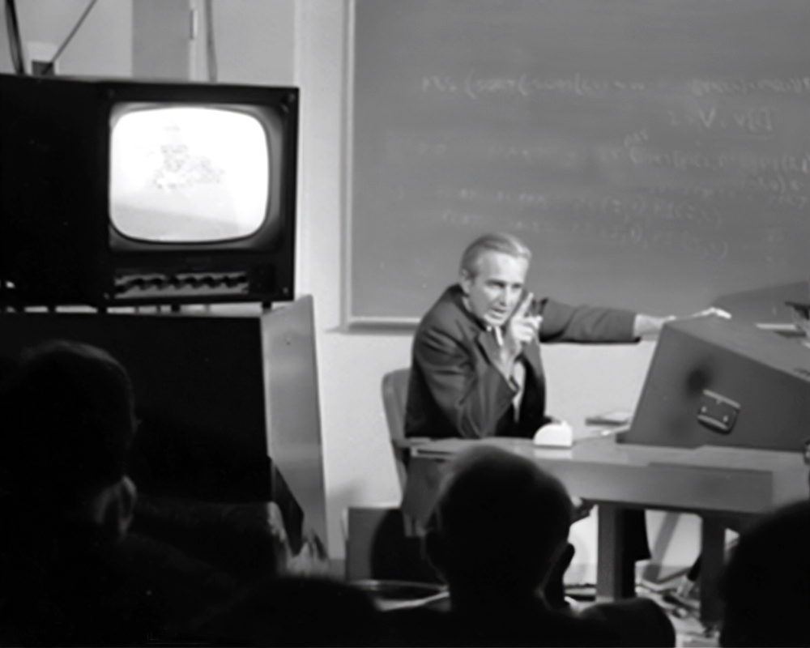
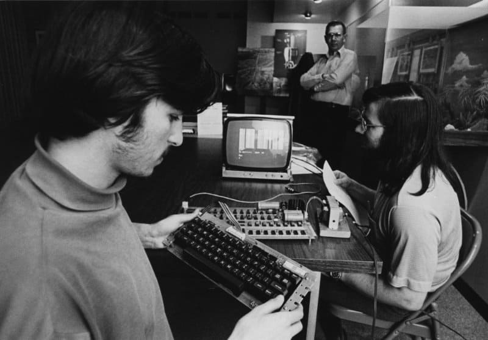

The historical phenomenon that demands our attention here is not simply a sequence of events or a collection of biographies, but rather a profound transformation in how technological imagination became entangled with political hope—and how this entanglement, far from being accidental or superficial, was made possible by specific intellectual, social, and material conditions that converged in Northern California during the late 1960s and early 1970s. What occurred was not merely the influence of one cultural sphere upon another, but an active hybridization: the grafting of countercultural ideals of autonomy, decentralization, and communal self-organization onto the emerging practices and infrastructures of personal computing and networked communication. This grafting succeeded—if that is the right word for a process whose outcomes remain so contested—because both worlds shared a common set of conceptual resources, chief among them the language and logic of cybernetics<a href="#ref-1">1</a> and systems thinking<a href="#ref-2">2</a>. Yet the success of this graft also ensured that the emancipatory impulses of the counterculture would be channeled into technological and entrepreneurial forms, effectively depoliticizing them and rendering them compatible with emerging neoliberal arrangements of power. The question we must pursue is not whether this hybridization happened—it clearly did—but rather why it was possible, what made it intellectually and socially coherent, and what its consequences have been for the way we understand technology, economy, and collective life today.

## The Intellectual Architecture of Hybridization: Cybernetics as Common Ground

To understand how hippies and hackers could find common cause, we must first recognize that both drew from the same intellectual reservoir: the systems thinking and cybernetic theories that emerged from World War II and the Cold War research establishment. Cybernetics, as articulated by Norbert Wiener, Warren McCulloch, John von Neumann, and others, was a transdisciplinary project aimed at understanding feedback, control, and communication in systems—whether mechanical<a href="#ref-3">3</a>, biological<a href="#ref-4">4</a>, or social<a href="#ref-5">5</a>. It promised a unified language for describing the world: organisms could be understood as information-processing machines, societies as self-regulating systems, and communication as the circulation of signals that maintained homeostatic balance. This was a radically holistic vision, one that refused the Cartesian separation of mind and matter, subject and object, and instead emphasized patterns, relations, and processes<a href="#ref-6">6</a>.

What made cybernetics so attractive to both engineers and countercultural thinkers was precisely its ambiguity: it could be read as a tool of control (as critics like Lewis Mumford feared) or as a framework for understanding organic<a href="#ref-7">7</a>, decentralized, self-organizing systems<a href="#ref-9">9</a> (as Gregory Bateson and later Stewart Brand would insist) . Bateson, an anthropologist and systems theorist who became a key intellectual figure for the New Communalists, distinguished between what he called “first-order” and “second-order” cybernetics—the former concerned with external control and engineering, the latter with reflexive, participatory systems in which the observer is part of the system being observed<a href="#ref-8">8</a>. This distinction was crucial: it allowed countercultural figures to claim cybernetics not as a tool of technocratic domination but as a language for describing organic wholeness, ecological interdependence, and the dissolution of hierarchical boundaries between human and environment<a href="#ref-9">9</a>, individual and collective<a href="#ref-10">10</a>.

Fred Turner’s meticulous historical work demonstrates how Stewart Brand, trained in biology and steeped in the psychedelic and communalist scenes of the 1960s<a href="#ref-13">13</a>, positioned himself as a broker between these worlds<a href="#ref-2">2</a>. Brand was not a computer scientist, but he was deeply influenced by Bateson’s ideas and by the writings of Buckminster Fuller, whose concept of “whole systems” and synergetic thinking provided a vocabulary for imagining interconnectedness without hierarchy , efficiency without coercion<a href="#ref-9">9</a>.

The *Whole Earth Catalog*, which Brand launched in 1968, was explicitly structured as a systems manual—a guide to tools that would enable individuals and small communities to achieve self-sufficiency and autonomy<a href="#ref-10">10</a>.

But the tools it listed were not only material (hand tools, solar panels, geodesic domes) but also conceptual: books on cybernetics, information theory, ecology, and design science figured prominently, creating an intellectual bridge between back-to-the-land communes and the emerging world of personal computing<a href="#ref-10">10</a>. The *Whole Earth Catalog* offices in Menlo Park, California, were located near Stanford Research Institute (SRI), where Douglas Engelbart was developing the NLS (oN-Line System), a pioneering computer interface that introduced the mouse, hypertext, and collaborative editing<a href="#ref-12">12</a>. Engelbart’s vision of “augmenting human intellect” resonated powerfully with countercultural aspirations to expand consciousness and enhance collective creativity, and his research group operated with a communal, non-hierarchical ethos that mirrored the organizational experiments of the communes.

Brand himself participated in Engelbart’s famous 1968 demonstration—the “Mother of All Demos”—helping to stage the event and immediately recognizing the revolutionary potential of interactive computing<a href="#ref-11">11</a>. What Engelbart offered was not just a new machine but a new way of imagining human-computer symbiosis: computers could be communication devices, tools for thought, media for collaboration—not merely calculating engines but extensions of human agency<a href="#ref-12">12</a>.

This vision was profoundly shaped by the Cold War context in which it emerged. ARPANET, the precursor to the Internet, was funded by the Department of Defense as a robust, decentralized communication network capable of surviving nuclear attack<a href="#ref-13">13</a>. Yet the same infrastructure that served military purposes could also be reimagined as a tool for grassroots organizing, countercultural communication, and the free exchange of knowledge—precisely because its architecture was distributed rather than centralized, peer-to-peer rather than hierarchical. The irony, of course, is that this decentralized architecture was itself a product of military-industrial research, funded by the very institutions that the counterculture opposed. But this contradiction was not perceived as such by many participants; instead, they saw an opportunity to appropriate and repurpose technologies<a href="#ref-11">11</a> developed by the establishment for radically different ends<a href="#ref-14">14</a>.

The role of psychedelics in this intellectual convergence should not be underestimated. LSD and other psychoactive substances were widely used by both engineers and countercultural figures during this period, often in the context of sanctioned research exploring their potential to enhance creativity, problem-solving<a href="#ref-14">14</a>, and perceptual flexibility<a href="#ref-15">15</a>. Douglas Engelbart participated in LSD experiments at SRI; Steve Jobs credited his own psychedelic experiences with shaping his approach to design and his belief in the transformative power of technology. The psychedelic experience, with its dissolution of ego boundaries and its revelation of hidden patterns and connections, mapped remarkably well onto the cybernetic vision of the world<a href="#ref-13">13</a> as an interconnected information system<a href="#ref-14">14</a>. Both psychedelics and cybernetics offered ways of perceiving reality as fundamentally relational, dynamic, and processual—and both suggested that expanding consciousness (whether chemically or technologically) was the key to personal and social transformation<a href="#ref-15">15</a>.

## The Social and Material Conditions of Convergence

Yet intellectual affinities alone cannot explain why this hybridization occurred so successfully in Northern California and not elsewhere<a href="#ref-16">16</a>. We must also attend to the specific social and material conditions that made the Bay Area a site of convergence between counterculture and computing. Geographically, the region was already home to both a thriving countercultural scene (centered in San Francisco’s Haight-Ashbury and Berkeley) and a burgeoning electronics industry (centered in what would soon be called Silicon Valley)<a href="#ref-17">17</a>. These two worlds were not as separate as one might imagine: many young engineers and programmers were themselves veterans of the anti-war movement, participants in the Free Speech Movement, or sympathizers with countercultural ideals<a href="#ref-18">18</a>. The Homebrew Computer Club, founded in 1975 by Fred Moore—a draft resister and anti-war activist—exemplified this convergence: its meetings brought together hobbyists, engineers, and entrepreneurs who shared a belief that personal computers could be tools of empowerment and liberation, not just instruments of corporate or state control<a href="#ref-19">19</a>.

Moore’s vision was explicitly political: he wanted access to computing power in order to support grassroots organizing and social justice work, and he saw the democratization of computing as part of a broader project of decentralizing power and fostering participatory democracy<a href="#ref-11">11</a>. The Homebrew ethos of open sharing—trading circuit diagrams, exchanging software, collectively solving technical problems—was directly borrowed from countercultural practices of communal living and resource-sharing<a href="#ref-20">20</a>. Steve Wozniak later remarked that the Apple I was designed not as a commercial product but as a contribution to this community of tinkerers and experimenters; only later, under Steve Jobs’ influence, did it become the basis for a business<a href="#ref-19">19</a>. This trajectory—from communal sharing to entrepreneurial capitalism—is emblematic of the broader transformation we are tracing.

The economic context is equally important. By the mid-1970s, many of the rural communes established by the back-to-the-land movement were collapsing, victims of internal conflicts, economic unsustainability, and the sheer difficulty of living outside the mainstream economy<a href="#ref-22">22</a>. Thousands of former communards found themselves back in the Bay Area, often broke and in need of work. The emerging computer industry offered employment opportunities that were relatively informal, meritocratic (or so it seemed), and open to people without conventional credentials. More importantly, this work could be framed as continuous with countercultural values: building tools for empowerment, creating alternatives to corporate and state bureaucracies, fostering new forms of community and communication<a href="#ref-23">23</a>. Stewart Brand himself moved seamlessly from editing the *Whole Earth Catalog* to co-founding the WELL (Whole Earth ‘Lectronic Link) in 1985—one of the first online communities, explicitly modeled on the communal and participatory ideals of the counterculture<a href="#ref-24">24</a>.

The WELL became a laboratory for what would later be called “virtual community,” demonstrating that meaningful social bonds, collective intelligence, and mutual support could emerge through text-based, asynchronous communication<a href="#ref-24">24</a>. Howard Rheingold, one of the WELL’s early participants, documented this phenomenon in his 1993 book *The Virtual Community*, arguing that online networks could foster a sense of belonging and solidarity comparable to (or even exceeding) that of physical communities<a href="#ref-25">25</a>. This was a powerful claim, and it resonated deeply with the Californian ideology’s promise that technology could solve social problems without requiring structural political change. If community could be built through voluntary association in cyberspace, then the difficult work of confronting inequality, redistributing resources, or challenging entrenched power structures might be bypassed entirely<a href="#ref-26">26</a>. This evasion—the fantasy that technological infrastructure could substitute for political struggle—would prove consequential for everything that followed.

## The Ambiguities and Contradictions of the Graft

What made this hybridization successful—intellectually coherent, socially plausible, materially sustainable—was also what made it politically ambiguous and ultimately contradictory. The countercultural emphasis on individual autonomy and self-actualization, when grafted onto entrepreneurial capitalism, produced not a challenge to market logic but a renewal of it. The same tools that were imagined as instruments of liberation—personal computers, networks, open-source software—could be (and were) turned into commodities, platforms, and infrastructures for profit extraction<a href="#ref-27">27</a> and control<a href="#ref-28">28</a>. The Homebrew Computer Club’s ethic of open sharing collided spectacularly with Bill Gates’ 1976 “Open Letter to Hobbyists,” in which he accused club members of theft for copying his BASIC interpreter and insisted that software development required compensation, not voluntarism. Gates’ letter marked an early skirmish in a battle that continues today: between those who see software and knowledge as commons to be collectively maintained and those who see them as property to be privately owned and monetized<a href="#ref-29">29</a>.

Richard Barbrook and Andy Cameron, in their 1995 essay “The Californian Ideology,” diagnosed this hybrid formation with remarkable clarity. They argued that Silicon Valley had achieved an improbable synthesis of two seemingly opposed worldviews: the left-libertarian faith in individual freedom and communal cooperation, and the right-libertarian enthusiasm for free markets and entrepreneurial competition<a href="#ref-22">22</a>. This synthesis was enabled by a shared belief in technological determinism—the idea that technology, rather than politics, was the primary driver of social change. If the right tools were made available, beneficial outcomes would emerge spontaneously, without the need for collective deliberation, democratic governance, or redistributive policies ^([(30)](https://www.versobooks.com/en-gb/products/2621-late-capitalism)). This was, as Barbrook and Cameron noted, a profoundly anti-political stance, one that celebrated individual empowerment while ignoring structural inequalities<a href="#ref-31">31</a> and concentrations of power<a href="#ref-32">32</a>.

Fred Turner extends this critique by showing how the New Communalists’ retreat from agonistic politics—from mass movements, institutional struggle, and confrontational tactics—left them ill-equipped to challenge the corporate and state forces that would eventually dominate the digital landscape<a href="#ref-2">2</a>. By focusing on consciousness, technology, and small-scale experimentation, they effectively ceded the terrain of large-scale political and economic power to others<a href="#ref-23">23</a>. The result was a vision of social change that was simultaneously radical and conservative: radical in its rejection of conventional authority and hierarchy, conservative in its acceptance of market mechanisms and its reluctance to engage with questions of distribution, ownership, and collective governance<a href="#ref-23">23</a>.

Cédric Durand, among others, has argued that this dynamic has only intensified in recent decades, as platform capitalism has entrenched itself and the digital commons have been increasingly enclosed. But Durand’s diagnosis—that we have entered an era of “techno-feudalism”<a href="#ref-33">33</a>—has been contested by critics like Evgeny Morozov, who insist that what we are witnessing is not the decline of capitalism but its intensification and monopolization<a href="#ref-34">34</a>. Morozov argues that framing Big Tech firms as feudal lords extracting passive tribute obscures the reality that these corporations are engaged in fierce competition, continuous technological innovation, and aggressive capital accumulation. This debate is important not merely as a terminological dispute but because it forces us to confront the question of continuity and rupture: to what extent does the current digital economy represent a qualitatively new formation<a href="#ref-35">35</a>, and to what extent is it simply capitalism operating under new technical conditions?<a href="#ref-36">36</a>.

What the history of the counterculture-computing hybridization reveals is that the emancipatory potential of technology is never inherent in the tools themselves but is always contingent on the social, economic, and political arrangements within which those tools are embedded<a href="#ref-37">37</a>. The same distributed networks that enabled the WELL’s vibrant community also enabled surveillance, commodification, and the concentration of power in the hands of platform giants<a href="#ref-28">28</a>. The same open-source ethos that produced GNU/Linux and Wikipedia also provided the foundation for commercial platforms that extract value from user-generated content without compensating its creators<a href="#ref-38">38</a>. The challenge, then, is not to celebrate or condemn technology as such, but to ask under what conditions it serves collective rather than private ends, and how we might build institutions capable of governing it democratically<a href="#ref-39">39</a>.

This is the critical task that the Californian ideology evades: by locating agency in individual consciousness and technological tools rather than in collective institutions and political struggle, it forecloses the possibility of genuinely democratic governance of the digital realm. The hybridization of counterculture and computing was successful precisely because it offered a way to imagine social transformation that bypassed the hard work of building coalitions, negotiating conflicts, and confronting entrenched interests. But this success was also a failure—a failure to recognize that tools, however powerful, cannot substitute for politics, and that the dream of spontaneous order and frictionless coordination is not a liberation but an evasion of the responsibilities and possibilities of collective self-governance<a href="#ref-40">40</a>.

## References

1. Dubberly, H., & Pangaro, P. (2015). How cybernetics connects computing, counterculture, and design. In *Hippie modernism: The struggle for utopia* (pp. 126–141). Walker Art Center. <https://www.dubberly.com/articles/cybernetics-and-counterculture.html>
2. Turner, F. (2006). *From counterculture to cyberculture: Stewart Brand, the Whole Earth network, and the rise of digital utopianism*. University of Chicago Press. <https://press.uchicago.edu/ucp/books/book/chicago/F/bo5896211.html>
3. Wiener, N. (1948). *Cybernetics: Or control and communication in the animal and the machine*. MIT Press. <https://mitpress.mit.edu/9780262537841/cybernetics/>
4. McCulloch, W., & Pitts, W. (1943). A logical calculus of ideas immanent in nervous activity. *Bulletin of Mathematical Biophysics*, 5(4), 115–133.
5. Von Neumann, J. (1966). *Theory of self-reproducing automata*. University of Illinois Press.
6. Pickering, A. (2010). *The cybernetic brain: Sketches of another future*. University of Chicago Press.
7. Bateson, G. (1972). *Steps to an ecology of mind*. Ballantine Books.
8. Von Foerster, H. (1979). Cybernetics of cybernetics. In K. Krippendorff (Ed.), *Communication and control in society* (pp. 5–8). Gordon and Breach.
9. Fuller, R. B. (1969). *Operating manual for spaceship Earth*. Southern Illinois University Press. <https://designsciencelab.com/resources/OperatingManual_BF.pdf>
10. Brand, S. (1968–1972). *Whole Earth Catalog*. Portola Institute. <https://monoskop.org/Whole_Earth_Catalog>
11. Markoff, J. (2005). *What the dormouse said: How the sixties counterculture shaped the personal computer industry*. Viking Penguin.
12. Engelbart, D. C. (1962). *Augmenting human intellect: A conceptual framework* (SRI Summary Report AFOSR-3223). Stanford Research Institute.
13. Hafner, K., & Lyon, M. (1996). *Where wizards stay up late: The origins of the Internet*. Simon & Schuster.
14. Doblin, R. (2023). Historicizing psychedelics: Counterculture, renaissance, and regulatory science. *Frontiers in Psychology*, 14, 1184620. <https://www.frontiersin.org/articles/10.3389/fpsyg.2023.1184620>
15. Isaacson, W. (2011). *Steve Jobs*. Simon & Schuster.
16. Jobs, S. (2005, June 12). *Stanford University commencement address* \[Speech\]. Stanford University. <https://news.stanford.edu/2005/06/14/jobs-061505/>
17. Rorabaugh, W. J. (2015). *American hippies*. Cambridge University Press.
18. Markoff, J. (2005). *What the dormouse said: How the sixties counterculture shaped the personal computer industry*. Viking Penguin.
19. Turner, F. (2006). *From counterculture to cyberculture: Stewart Brand, the Whole Earth network, and the rise of digital utopianism*. University of Chicago Press.
20. Markoff, J. (2005). *What the dormouse said: How the sixties counterculture shaped the personal computer industry*. Viking Penguin.
21. Turner, F. (2006). *From counterculture to cyberculture: Stewart Brand, the Whole Earth network, and the rise of digital utopianism*. University of Chicago Press.
22. Barbrook, R., & Cameron, A. (1996). The Californian ideology. *Science as Culture*, 6(1), 44–72.
23. Turner, F. (2006). *From counterculture to cyberculture: Stewart Brand, the Whole Earth network, and the rise of digital utopianism*. University of Chicago Press.
24. Brand, S., & Brilliant, L. (1985). The WELL: Access to tools. *Whole Earth Review*, 45, 4–9.
25. Rheingold, H. (2000). *The virtual community: Homesteading on the electronic frontier* (Rev. ed.). MIT Press. <https://www.rheingold.com/vc/book/>
26. Srnicek, N. (2017). *Platform capitalism*. Polity Press. <https://www.politybooks.com/book/platform-capitalism/>
27. Zuboff, S. (2019). *The age of surveillance capitalism: The fight for a human future at the new frontier of power*. PublicAffairs. <https://www.shoshanazuboff.com/book/surveillance-capitalism/>
28. Ostrom, E. (1990). *Governing the commons: The evolution of institutions for collective action*. Cambridge University Press.
29. Stallman, R. (2002). *Free software, free society: Selected essays of Richard M. Stallman*. Free Software Foundation. <https://www.gnu.org/philosophy/fsfs/>
30. Raymond, E. S. (1999). The cathedral and the bazaar. *First Monday*, 3(3). <http://www.firstmonday.org/ojs/index.php/fm/article/view/578>
31. Barbrook, R., & Cameron, A. (1996). The Californian ideology. *Science as Culture*, 6(1), 44–72.
32. Barbrook, R., & Cameron, A. (1996). The Californian ideology. *Science as Culture*, 6(1), 44–72.
33. Durand, C. (2020). *Techno-féodalisme: Critique de l’économie numérique*. La Découverte/Zones.
34. Morozov, E. (2025, August). Le numérique nous ramène-t-il au Moyen Âge? *Le Monde Diplomatique*, 1, 8–9. <https://www.monde-diplomatique.fr/2025/08>
35. Rikap, C. (2021). *Capitalism, power and innovation: Intellectual monopoly capitalism uncovered*. Routledge. <https://www.routledge.com/Capitalism-Power-and-Innovation-Intellectual-Monopoly-Capitalism-Uncovered/Rikap/p/book/9780367750299>
36. Rikap, C. (2023). Capitalism as usual? Implications of digital intellectual monopolies. *New Left Review*, 139, 145–160. <https://newleftreview.org/issues/ii139/articles/cecilia-rikap-capitalism-as-usual>
37. Mandel, E. (1975/2024). *Late capitalism* (2nd ed.). Verso Press. <https://www.versobooks.com/en-gb/products/2621-late-capitalism>
38. Wikipedia Contributors. (2025). Wikipedia: The free encyclopedia. *Wikimedia Foundation*. <https://en.wikipedia.org/wiki/Wikipedia:About>
39. Ostrom, E. (1990). *Governing the commons: The evolution of institutions for collective action*. Cambridge University Press.
40. Turner, F. (2006). *From counterculture to cyberculture: Stewart Brand, the Whole Earth network, and the rise of digital utopianism*. University of Chicago Press.

