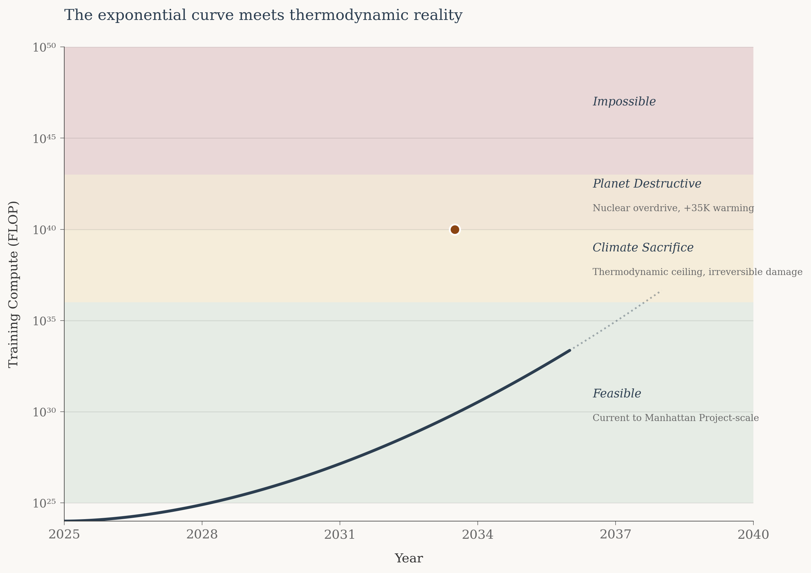
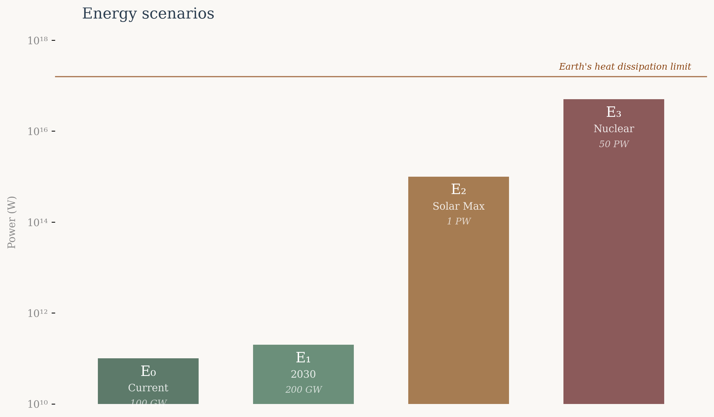
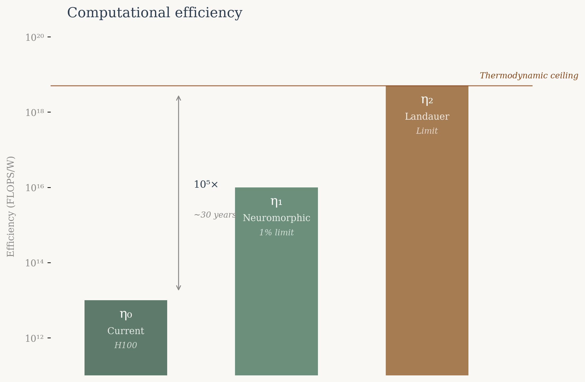
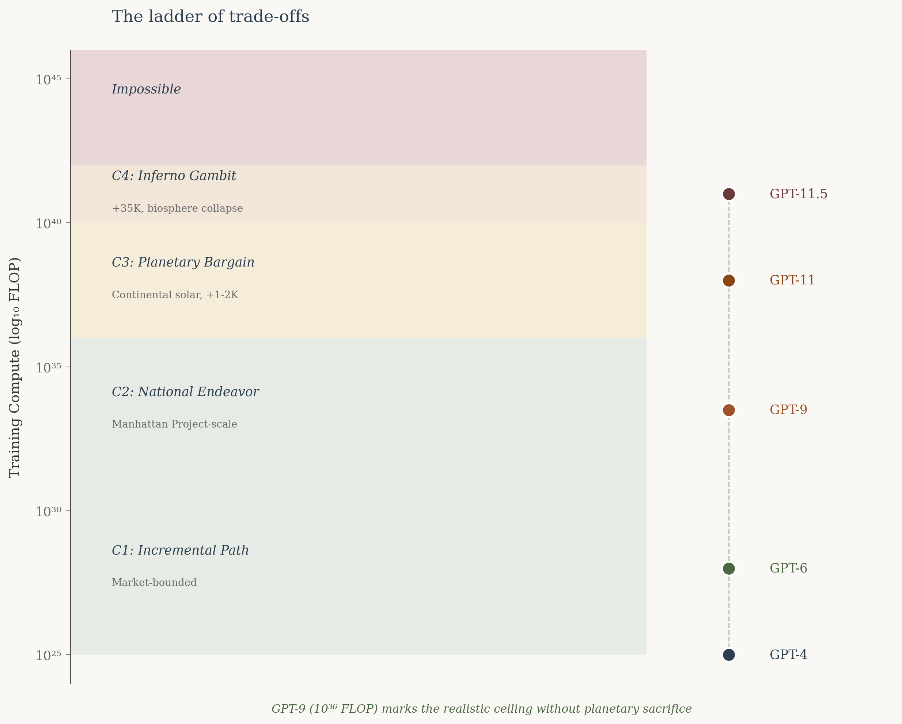
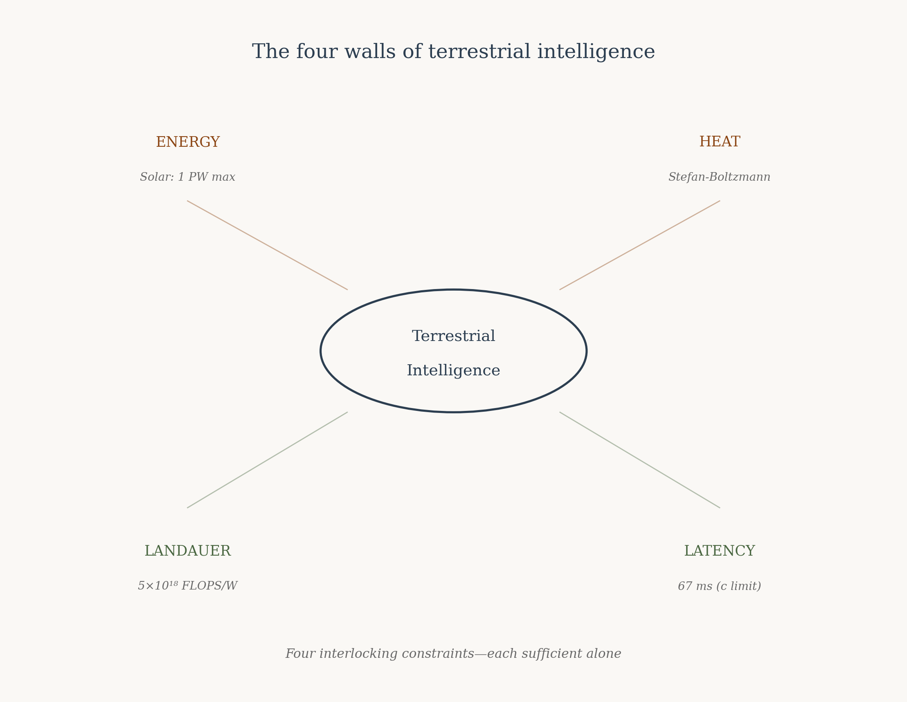
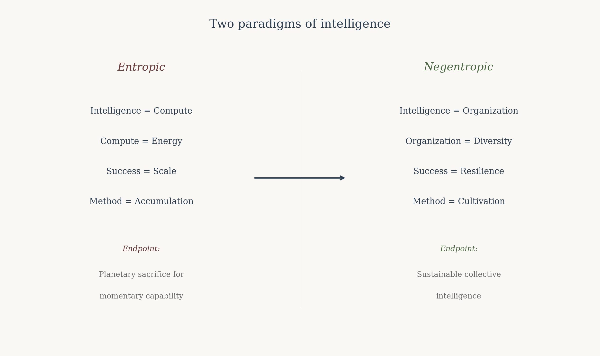

Projections of AI compute typically depict an exponential curve rising indefinitely—training requirements climbing from 10²⁵ to 10³⁰ to 10⁴⁰ FLOP with no visible ceiling.

The implicit assumption is that intelligence scales without bound, limited only by capital and engineering. Yet all exponential processes terminate. The question is not whether AI scaling will encounter constraints, but where those constraints lie.

This article examines the upper bounds of trained AI systems based on energy availability, thermodynamic limits of computation, and heat dissipation capacity of Earth. The analysis suggests that without planetary-scale disruption, approximately GPT-9 level (10³⁶ FLOP) represents a realistic ceiling.

Accepting significant climate destabilization extends this to GPT-11 (10⁴⁰ FLOP). Catastrophic scenarios involving biosphere collapse might reach GPT-11.5 (10⁴¹ FLOP).

These constitute the thermodynamic boundaries of terrestrial intelligence.

## Framework

Three factors structure this analysis:

**Energy** — bounded by solar radiation incident on Earth and the planet’s capacity to dissipate heat into space. This constitutes the primary constraint on computation.

**Computational efficiency** — bounded by thermodynamic principles, specifically the Landauer limit on irreversible computation. Efficiency improvements can extend capability but cannot escape physical law.

**Training paradigm** — the current approach to frontier language models involves expensive, extended training runs followed by relatively lower-cost inference. This analysis assumes continuation of this paradigm.

## Energy Constraints

We consider four energy scenarios of increasing magnitude:

**E₀ = 100 GW** (10¹¹ W) — current global datacenter capacity, 2025.

**E₁ = 200 GW** (2×10¹¹ W) — projected global datacenter capacity by 2030.

**E₂ = 1 PW** (10¹⁵ W) — theoretical maximum from solar capture at continental scale.

**E₃ = 50 PW** (5×10¹⁶ W) — nuclear energy generation at catastrophic scale.

The E₂ scenario derives from the following calculation. Given Earth’s surface area of 5×10¹⁴ m², land coverage of 29%, average solar irradiance of 168 W/m², and assuming 20% land utilization with 20% conversion efficiency:

$$
E_2 = (5 \times 10^{14}\,\mathrm{m^2}) \times (0.29 \times 0.20 \times 0.20) \times (168\,\mathrm{W/m^2}) \approx 10^{15}\,\mathrm{W}
$$

Solar capture at this scale would reduce Earth’s albedo, contributing 1-2K of warming through altered reflectivity. However, solar power possesses a crucial thermodynamic advantage: it redirects energy already arriving at Earth rather than introducing new heat into the system.

Nuclear and fusion power introduce a fundamental problem absent from solar. Earth dissipates heat according to the Stefan-Boltzmann law:

$$
P = \sigma \varepsilon A T^4
$$

Energy generated on Earth—rather than captured from incident sunlight—must be dissipated as additional heat, raising equilibrium temperature. The relationship between power generation and temperature increase follows from radiative balance:

| Power Added     | Earth Temperature | Consequence               |
|-----------------|-------------------|---------------------------|
| 0 PW (baseline) | 290 K (17°C)      | Current conditions        |
| 1 PW            | 291 K             | Marginal warming          |
| 10 PW           | 298 K             | Significant climate shift |
| 50 PW           | 325 K (52°C)      | Biosphere collapse        |

*Relationship between terrestrial power generation and equilibrium temperature*

At 325 K average temperature, polar ice would melt entirely, raising sea levels by tens of meters. Trapped methane would release, triggering feedback loops. Fresh water and portions of oceans would begin evaporating. This represents an approximate upper bound on terrestrial energy generation.

## Computational Efficiency Limits

The Landauer principle establishes a fundamental lower bound on energy consumption for irreversible computation. Erasing one bit of information requires minimum energy:

$$
E_{\min} = k_B\,T \ln(2)
$$

At terrestrial temperature (300 K):

$$
E_{\min} = 2.87 \times 10^{-21}\,\mathrm{J}
$$

Converting to floating-point operations (assuming approximately 50 bit operations per FLOP, accounting for precision and the fact that Landauer’s principle applies specifically to bit erasure), the theoretical maximum efficiency is:

$$
\eta_{\max} = \frac{1}{50 \times E_{\min}} \approx 5 \times 10^{18}\ \mathrm{FLOPS/W}
$$

Current hardware achieves approximately 10¹³ FLOPS/W (NVIDIA H100), five orders of magnitude below the theoretical limit. At historical rates of efficiency improvement, closing this gap would require roughly 30 years.

Three efficiency scenarios structure the subsequent analysis:

**η₀ = 10¹³ FLOPS/W** — current state of the art (H100-class hardware).

**η₁ = 5×10¹⁶ FLOPS/W** — 1% of Landauer limit, potentially achievable through neuromorphic or novel architectures.

**η₂ = 5×10¹⁸ FLOPS/W** — approaching Landauer limit, requiring near-perfect reversible computing.

## Scenarios

Current estimates place GPT-4 training compute at approximately 10²⁵ FLOP. Historical progression suggests each model generation requires roughly 100× more compute. Combining energy and efficiency scenarios yields a ladder of possibilities with escalating consequences.

### C1: Market-Bounded Growth

Progress constrained by commercial investment and existing infrastructure.

*Parameters:* E₀ (100 GW), η₀ (10¹³ FLOPS/W), 6-month training, 20% utilization.

$$
(10^{13}) \times (10^{11}) \times (1.6 \times 10^{7}) \times (0.2) \approx 3.1 \times 10^{31}\ \mathrm{FLOP}
$$

*Outcome:* GPT-6 equivalent. Represents the trajectory of incremental commercial development.

### C2: Coordinated National Effort

State-level mobilization comparable to the Manhattan Project, driving both infrastructure expansion and efficiency breakthroughs.

*Parameters:* E₁ (200 GW), η₁ (5×10¹⁶ FLOPS/W), 6-month training, 20% utilization.

$$
(5 \times 10^{16}) \times (2 \times 10^{11}) \times (1.6 \times 10^{7}) \times (0.2) \approx 3.1 \times 10^{35}\ \mathrm{FLOP}
$$

*Outcome:* GPT-9 equivalent—10,000× more capable than C1. This scenario requires substantial scientific breakthroughs in computational efficiency but remains within sustainable energy bounds.

### C3: Planetary Commitment

Global coordination accepting significant ecological cost for maximum terrestrial intelligence.

*Parameters:* E₂ (1 PW), η₂ (5×10¹⁸ FLOPS/W), 6-month training, 20% utilization.

$$
(5 \times 10^{18}) \times (10^{15}) \times (1.6 \times 10^{7}) \times (0.2) \approx 1.6 \times 10^{40}\ \mathrm{FLOP}
$$

*Outcome:* GPT-11 equivalent. Requires continental-scale solar coverage, near-Landauer efficiency, and acceptance of 1-2K warming from albedo changes.

### C4: Catastrophic Overshoot

Pursuit of maximum capability regardless of planetary consequences.

*Parameters:* E₃ (50 PW), η₂ adjusted for 325K (4.6×10¹⁸ FLOPS/W), 6-month training, 20% utilization.

$$
(4.6 \times 10^{18}) \times (5 \times 10^{16}) \times (1.6 \times 10^{7}) \times (0.2) \approx 7.4 \times 10^{41}\ \mathrm{FLOP}
$$

*Outcome:* GPT-11.5 equivalent—a marginal gain of 0.5 generations. Cost: biosphere collapse, ocean evaporation, civilizational destruction. A pyrrhic achievement.

## Constraints and Objections

Several additional constraints compound those discussed above.

**Distribution and latency.** Scenarios E₂ and E₃ require planetary-scale heat dissipation, which necessitates geographic distribution of compute. This introduces speed-of-light latency—a signal traversing Earth requires approximately 67 milliseconds. Current training algorithms assume low-latency synchronization; distributed architectures would require fundamental algorithmic innovation.

**Quantum computing.** While quantum systems excel at specific problem classes, their applicability to neural network training remains uncertain. Moreover, cryogenic cooling requirements would shift rather than eliminate thermodynamic burdens.

**Reversible computing.** Theoretically capable of circumventing Landauer limits by avoiding bit erasure, reversible computing remains incompatible with current training methods. Backpropagation inherently involves irreversible weight updates. As Michael Frank has noted, practical reversible computing would require changes as fundamental as the transition from stone tablets to microprocessors.

**Extended training.** Longer training duration offers linear gains: one order of magnitude per decade. Reaching GPT-11 through duration alone would require millennia—at which point the endeavor becomes indistinguishable from civilizational projects like Dyson sphere construction.

## Food for Thought: An Alternative Framework

The preceding analysis operates within a specific paradigm: intelligence as a quantity produced through energy expenditure. This framing, while useful for establishing bounds, may obscure alternative approaches.

The philosopher Bernard Stiegler developed a critique of what he termed “entropization”—the tendency of technological systems to accelerate energy dissipation while impoverishing knowledge diversity. Against this, he proposed “negentropy”: the cultivation of difference and organization that works against universal disorder.

### C5: Organizational Intelligence

Intelligence scaling through structural innovation rather than energy accumulation.

*Framework:* Knowledge Diversity Index measuring organizational complexity:

$$
\mathrm{KDI} = \exp(H(K)), \qquad H(K) = -\sum p(k_i) \log p(k_i)
$$

*Parameters:* Collective learning efficiency 10-100× current approaches; energy requirement 1-100 MW.

*Outcome:* Not a singular superintelligence but a distributed cognitive ecosystem—resilient, adaptive, sustainable. The human scientific community offers a partial model: collective intelligence emerging from diverse perspectives rather than concentrated computation.

## Conclusions

The thermodynamic analysis yields several conclusions:

GPT-9 (10³⁶ FLOP) represents the realistic upper bound for training runs compatible with sustainable energy systems, achievable through coordinated effort and substantial efficiency improvements.

GPT-11 (10⁴⁰ FLOP) constitutes the theoretical maximum within Earth’s heat dissipation capacity, requiring near-Landauer efficiency and acceptance of significant climate disruption.

Beyond this, marginal capability gains demand catastrophic planetary costs. The thermodynamic return on civilizational investment becomes vanishingly small.

These bounds are not arbitrary policy constraints but physical law. Earth is a closed thermodynamic system with finite capacity for computation. Intelligence that wishes to continue scaling must either leave the planet or transform its own paradigm.

The fifth scenario suggests such a transformation may be possible. Perhaps the relevant question is not how much energy intelligence requires, but how intelligence might be cultivated rather than manufactured—a shift from entropy to negentropy, from accumulation to organization.

---

## References

### Foundational Physics & Thermodynamics

Landauer, R. (1961). Irreversibility and Heat Generation in the Computing Process. *IBM Journal of Research and Development*, 5(3), 183-191. <https://doi.org/10.1147/rd.53.0183>

Bennett, C.H. (1973). Logical Reversibility of Computation. *IBM Journal of Research and Development*, 17(6), 525-532. <https://doi.org/10.1147/rd.176.0525>

Bennett, C.H. (2003). Notes on Landauer’s principle, reversible computation, and Maxwell’s demon. *Studies in History and Philosophy of Science Part B: Studies in History and Philosophy of Modern Physics*, 34(3), 501-510. <https://doi.org/10.1016/S1355-2198(03)00039-X>

Berut, A., Arakelyan, A., Petrosyan, A., Ciliberto, S., Dillenschneider, R., & Lutz, E. (2012). Experimental verification of Landauer’s principle linking information and thermodynamics. *Nature*, 483(7388), 187-189. <https://doi.org/10.1038/nature10872>

Stefan, J. (1879). Über die Beziehung zwischen der Wärmestrahlung und der Temperatur. *Sitzungsberichte der Mathematisch-naturwissenschaftlichen Classe der Kaiserlichen Akademie der Wissenschaften*, 79, 391-428.

Boltzmann, L. (1884). Ableitung des Stefan’schen Gesetzes, betreffend die Abhängigkeit der Wärmestrahlung von der Temperatur aus der electromagnetischen Lichttheorie. *Annalen der Physik*, 258(6), 291-294.

### Limits of Computation

Markov, I.L. (2014). Limits on fundamental limits to computation. *Nature*, 512(7513), 147-154. <https://doi.org/10.1038/nature13570>

Lloyd, S. (2000). Ultimate physical limits to computation. *Nature*, 406(6799), 1047-1054. <https://doi.org/10.1038/35023282>

Frank, M.P. (2005). Approaching the physical limits of computing. *Proceedings of the 35th International Symposium on Multiple-Valued Logic (ISMVL’05)*, 168-185.

Frank, M.P. (2017). Throwing computing into reverse. *IEEE Spectrum*, 54(9), 32-37.

Kish, L.B. (2002). End of Moore’s law: thermal (noise) death of integration in micro and nano electronics. *Physics Letters A*, 305(3-4), 144-149. <https://doi.org/10.1016/S0375-9601(02)01365-8>

### AI Scaling Laws

Kaplan, J., McCandlish, S., Henighan, T., Brown, T.B., Chess, B., Child, R., Gray, S., Radford, A., Wu, J., & Amodei, D. (2020). Scaling Laws for Neural Language Models. *arXiv preprint arXiv:2001.08361*. <https://arxiv.org/abs/2001.08361>

Hoffmann, J., Borgeaud, S., Mensch, A., Buchatskaya, E., Cai, T., Rutherford, E., … & Sifre, L. (2022). Training Compute-Optimal Large Language Models. *arXiv preprint arXiv:2203.15556*. <https://arxiv.org/abs/2203.15556>

Sevilla, J., Heim, L., Ho, A., Besiroglu, T., Hobbhahn, M., & Villalobos, P. (2022). Compute Trends Across Three Eras of Machine Learning. *2022 International Joint Conference on Neural Networks (IJCNN)*, 1-8. <https://doi.org/10.1109/IJCNN55064.2022.9892016>

Epoch AI. (2024). Notable AI Models Database. <https://epochai.org/data/notable-ai-models>

Epoch AI. (2024). Parameter, Compute and Data Trends in Machine Learning. <https://epochai.org/mlinputs/visualization>

### Energy & Data Centers

International Energy Agency. (2024). Electricity 2024: Analysis and forecast to 2026. IEA Publications. <https://www.iea.org/reports/electricity-2024>

Masanet, E., Shehabi, A., Lei, N., Smith, S., & Koomey, J. (2020). Recalibrating global data center energy-use estimates. *Science*, 367(6481), 984-986. <https://doi.org/10.1126/science.aba3758>

Shehabi, A., Smith, S.J., Sartor, D.A., Brown, R.E., Herrlin, M., Koomey, J.G., … & Lintner, W. (2016). United States Data Center Energy Usage Report. *Lawrence Berkeley National Laboratory*, LBNL-1005775.

Patterson, D., Gonzalez, J., Le, Q., Liang, C., Munguia, L.M., Rothchild, D., … & Dean, J. (2021). Carbon Emissions and Large Neural Network Training. *arXiv preprint arXiv:2104.10350*. <https://arxiv.org/abs/2104.10350>

de Vries, A. (2023). The growing energy footprint of artificial intelligence. *Joule*, 7(10), 2191-2194. <https://doi.org/10.1016/j.joule.2023.09.004>

### Climate & Earth System

von Schuckmann, K., Cheng, L., Palmer, M.D., Hansen, J., Tassone, C., Aber, V., … & Wijffels, S.E. (2020). Heat stored in the Earth system: where does the energy go? *Earth System Science Data*, 12(3), 2013-2041. <https://doi.org/10.5194/essd-12-2013-2020>

Akbari, H., Menon, S., & Rosenfeld, A. (2009). Global cooling: increasing world-wide urban albedos to offset CO₂. *Climatic Change*, 94(3-4), 275-286. <https://doi.org/10.1007/s10584-008-9515-9>

Hansen, J., Sato, M., Kharecha, P., Beerling, D., Berner, R., Masson-Delmotte, V., … & Zachos, J.C. (2008). Target atmospheric CO₂: Where should humanity aim? *The Open Atmospheric Science Journal*, 2(1), 217-231.

Stephens, G.L., Li, J., Wild, M., Clayson, C.A., Loeb, N., Kato, S., … & Andrews, T. (2012). An update on Earth’s energy balance in light of the latest global observations. *Nature Geoscience*, 5(10), 691-696. <https://doi.org/10.1038/ngeo1580>

### Neuromorphic & Alternative Computing

Mead, C. (1990). Neuromorphic electronic systems. *Proceedings of the IEEE*, 78(10), 1629-1636. <https://doi.org/10.1109/5.58356>

Indiveri, G., & Liu, S.C. (2015). Memory and information processing in neuromorphic systems. *Proceedings of the IEEE*, 103(8), 1379-1397. <https://doi.org/10.1109/JPROC.2015.2444094>

Davies, M., Srinivasa, N., Lin, T.H., Chinya, G., Cao, Y., Choday, S.H., … & Wang, H. (2018). Loihi: A neuromorphic manycore processor with on-chip learning. *IEEE Micro*, 38(1), 82-99. <https://doi.org/10.1109/MM.2018.112130359>

Merolla, P.A., Arthur, J.V., Alvarez-Icaza, R., Cassidy, A.S., Sawada, J., Akopyan, F., … & Modha, D.S. (2014). A million spiking-neuron integrated circuit with a scalable communication network and interface. *Science*, 345(6197), 668-673. <https://doi.org/10.1126/science.1254642>

### Distributed Computing & Latency

Dean, J., & Barroso, L.A. (2013). The tail at scale. *Communications of the ACM*, 56(2), 74-80. <https://doi.org/10.1145/2408776.2408794>

Narayanan, D., Shoeybi, M., Casper, J., LeGresley, P., Patwary, M., Korthikanti, V., … & Catanzaro, B. (2021). Efficient large-scale language model training on GPU clusters using Megatron-LM. *Proceedings of the International Conference for High Performance Computing, Networking, Storage and Analysis*, 1-15.

Rajbhandari, S., Rasley, J., Ruwase, O., & He, Y. (2020). ZeRO: Memory optimizations toward training trillion parameter models. *Proceedings of the International Conference for High Performance Computing, Networking, Storage and Analysis*, 1-16.

### Philosophy & Alternative Paradigms

Stiegler, B. (2018). *The Neganthropocene*. Open Humanities Press. <https://doi.org/10.26530/OAPEN_1004195>

Stiegler, B. (2015). *La Société automatique: 1. L’avenir du travail*. Fayard.

Simondon, G. (1958). *Du mode d’existence des objets techniques*. Aubier.

Wiener, N. (1948). *Cybernetics: Or Control and Communication in the Animal and the Machine*. MIT Press.

Bateson, G. (1972). *Steps to an Ecology of Mind*. University of Chicago Press.

Shannon, C.E. (1948). A Mathematical Theory of Communication. *Bell System Technical Journal*, 27(3), 379-423. <https://doi.org/10.1002/j.1538-7305.1948.tb01338.x>

### Collective Intelligence & Learning

Parisi, G.I., Kemker, R., Part, J.L., Kanan, C., & Wermter, S. (2019). Continual lifelong learning with neural networks: A review. *Neural Networks*, 113, 54-71. <https://doi.org/10.1016/j.neunet.2019.01.012>

Malone, T.W., & Bernstein, M.S. (Eds.). (2015). *Handbook of Collective Intelligence*. MIT Press.

Woolley, A.W., Chabris, C.F., Pentland, A., Hashmi, N., & Malone, T.W. (2010). Evidence for a collective intelligence factor in the performance of human groups. *Science*, 330(6004), 686-688. <https://doi.org/10.1126/science.1193147>

### Hardware Specifications

NVIDIA Corporation. (2022). NVIDIA H100 Tensor Core GPU Architecture. Technical White Paper.

NVIDIA Corporation. (2024). NVIDIA Blackwell Architecture. Technical White Paper.

TOP500. (2024). TOP500 Supercomputer Sites. <https://www.top500.org/>

### Additional Technical References

Koomey, J.G. (2011). Growth in data center electricity use 2005 to 2010. *Analytics Press*.

Strubell, E., Ganesh, A., & McCallum, A. (2019). Energy and Policy Considerations for Deep Learning in NLP. *Proceedings of the 57th Annual Meeting of the Association for Computational Linguistics*, 3645-3650. <https://doi.org/10.18653/v1/P19-1355>

Schwartz, R., Dodge, J., Smith, N.A., & Etzioni, O. (2020). Green AI. *Communications of the ACM*, 63(12), 54-63. <https://doi.org/10.1145/3381831>

Henderson, P., Hu, J., Romoff, J., Brunskill, E., Jurafsky, D., & Pineau, J. (2020). Towards the Systematic Reporting of the Energy and Carbon Footprints of Machine Learning. *Journal of Machine Learning Research*, 21(248), 1-43.

## Appendix: Detailed Calculations

This appendix provides complete derivations for all numerical results presented in the main text.

### A1. Landauer Principle

$$
\begin{aligned}
& E_{\min} = k_B\,T \ln(2) \\[0.75em]
& k_B = 1.380649 \times 10^{-23}\ \mathrm{J/K} \\[0.75em]
& T = 300\ \mathrm{K} \\[0.75em]
& E_{\min} = (1.38 \times 10^{-23}) \times (300) \times (0.693) \\[0.75em]
& E_{\min} = 2.87 \times 10^{-21}\ \mathrm{J/bit}
\end{aligned}
$$

### A2. Maximum Computational Efficiency

$$
\begin{aligned}
& \text{Assume: 50 bit operations per FLOP} \\[0.75em]
& \eta_{\max} = \frac{1}{n_{\mathrm{bits}} \times E_{\min}} \\[0.75em]
& \eta_{\max} = \frac{1}{50 \times 2.87 \times 10^{-21}\ \mathrm{J}} \\[0.75em]
& \eta_{\max} = \frac{1}{1.44 \times 10^{-19}\ \mathrm{J/FLOP}} \\[0.75em]
& \eta_{\max} = 6.97 \times 10^{18}\ \mathrm{FLOPS/W} \approx 5 \times 10^{18}\ \mathrm{FLOPS/W}
\end{aligned}
$$

### A3. Efficiency Gap Analysis

$$
\begin{aligned}
& \eta_{\mathrm{current}} = 10^{13}\ \mathrm{FLOPS/W}\ \text{(H100)} \\[0.75em]
& \eta_{\mathrm{Landauer}} = 5 \times 10^{18}\ \mathrm{FLOPS/W} \\[0.75em]
& \mathrm{Gap} = \eta_{\mathrm{Landauer}} / \eta_{\mathrm{current}} \\[0.75em]
& \mathrm{Gap} = 5 \times 10^{18} / 10^{13} = 5 \times 10^{5} \\[0.75em]
& \text{At Moore's Law (}2{\times}/2\text{ years):} \\[0.75em]
& \mathrm{Years} = \log_2(5 \times 10^{5}) \times 2 \approx 38\ \text{years}
\end{aligned}
$$

### A4. Stefan-Boltzmann Law

$$
\begin{aligned}
& P = \sigma \varepsilon A T^4 \\[0.75em]
& \sigma = 5.67 \times 10^{-8}\ \mathrm{W\,m^{-2}\,K^{-4}} \\[0.75em]
& \varepsilon \approx 0.612\ \text{(Earth's effective emissivity)} \\[0.75em]
& A = 5.1 \times 10^{14}\ \mathrm{m^2}\ \text{(Earth's surface)} \\[0.75em]
& \text{At equilibrium: }P_{\mathrm{in}} = P_{\mathrm{out}}
\end{aligned}
$$

### A5. Temperature vs Added Power

$$
\begin{aligned}
& P_{\mathrm{total}} = P_{\mathrm{solar}} + P_{\mathrm{added}} = \sigma \varepsilon A T^4 \\[0.75em]
& T = \left( \frac{P_{\mathrm{solar}} + P_{\mathrm{added}}}{\sigma \varepsilon A} \right)^{1/4} \\[0.75em]
& P_{\mathrm{solar}} \approx 1.74 \times 10^{17}\ \mathrm{W} \\[0.75em]
& \text{If }P_{\mathrm{added}} = 50\ \mathrm{PW} = 5 \times 10^{16}\ \mathrm{W}\text{:} \\[0.75em]
& T = \left( \frac{1.74 \times 10^{17} + 5 \times 10^{16}}{5.67 \times 10^{-8} \times 0.612 \times 5.1 \times 10^{14}} \right)^{1/4} \\[0.75em]
& T \approx 325\ \mathrm{K}\ \text{(+35 K above baseline)}
\end{aligned}
$$

### A6. Maximum Solar Power (E₂)

$$
\begin{aligned}
& A_{\mathrm{Earth}} = 5.1 \times 10^{14}\ \mathrm{m^2} \\[0.75em]
& f_{\mathrm{land}} = 0.29\ \text{(land fraction)} \\[0.75em]
& f_{\mathrm{coverage}} = 0.20\ \text{(practical land use)} \\[0.75em]
& \eta_{\mathrm{solar}} = 0.20\ \text{(panel to compute)} \\[0.75em]
& I = 168\ \mathrm{W/m^2}\ \text{(average irradiance)} \\[0.75em]
& E_2 = A_{\mathrm{Earth}} \times f_{\mathrm{land}} \times f_{\mathrm{coverage}} \times \eta_{\mathrm{solar}} \times I \\[0.75em]
& E_2 = (5.1 \times 10^{14}) \times (0.29) \times (0.20) \times (0.20) \times (168) \\[0.75em]
& E_2 = 9.94 \times 10^{14}\ \mathrm{W} \approx 1\ \mathrm{PW}
\end{aligned}
$$

### A7. Time Conversion

$$
\begin{aligned}
& t = 6\ \text{months} = 6 \times 30 \times 24 \times 3600\ \mathrm{s} \\[0.75em]
& t = 6 \times 30 \times 86{,}400\ \mathrm{s} \\[0.75em]
& t = 15{,}552{,}000\ \mathrm{s} \approx 1.577 \times 10^{7}\ \mathrm{s}
\end{aligned}
$$

### A8. GPT Scaling Relationship

$$
\begin{aligned}
& \text{GPT-4} \approx 10^{25}\ \mathrm{FLOP} \\[0.75em]
& \text{Each generation: }\times 100\text{ compute} \\[0.75em]
& \text{GPT-N} \approx 10^{25 + 2(N-4)}\ \mathrm{FLOP} \\[0.75em]
& \text{GPT-6: } 10^{25+4} = 10^{29} \text{ to } 10^{31}\ \mathrm{FLOP} \\[0.75em]
& \text{GPT-9: } 10^{25+10} = 10^{35} \text{ to } 10^{36}\ \mathrm{FLOP} \\[0.75em]
& \text{GPT-11: } 10^{25+14} = 10^{39} \text{ to } 10^{40}\ \mathrm{FLOP}
\end{aligned}
$$

### A9. Scenario C1: Market-Bounded Growth

$$
\begin{aligned}
& E_0 = 100\ \mathrm{GW} = 10^{11}\ \mathrm{W} \\[0.75em]
& \eta_0 = 10^{13}\ \mathrm{FLOPS/W} \\[0.75em]
& t = 6\ \text{months} = 1.577 \times 10^{7}\ \mathrm{s} \\[0.75em]
& u = 0.20\ \text{(utilization factor)} \\[0.75em]
& \mathrm{FLOP} = \eta \times E \times t \times u \\[0.75em]
& \mathrm{FLOP} = (10^{13}) \times (10^{11}) \times (1.577 \times 10^{7}) \times (0.20) \\[0.75em]
& \mathrm{FLOP} = 3.15 \times 10^{31}\ \mathrm{FLOP} \approx \textbf{GPT-6}
\end{aligned}
$$

### A10. Scenario C2: National Endeavor

$$
\begin{aligned}
& E_1 = 200\ \mathrm{GW} = 2 \times 10^{11}\ \mathrm{W} \\[0.75em]
& \eta_1 = 5 \times 10^{16}\ \mathrm{FLOPS/W}\ \text{(1\% Landauer)} \\[0.75em]
& t = 1.577 \times 10^{7}\ \mathrm{s}, \quad u = 0.20 \\[0.75em]
& \mathrm{FLOP} = (5 \times 10^{16}) \times (2 \times 10^{11}) \times (1.577 \times 10^{7}) \times (0.20) \\[0.75em]
& \mathrm{FLOP} = 3.15 \times 10^{35}\ \mathrm{FLOP} \approx \textbf{GPT-9} \\[0.75em]
& \text{Gain vs C1: }10^{35} / 10^{31} = 10^{4} = 10{,}000\times
\end{aligned}
$$

### A11. Scenario C3: Planetary Commitment

$$
\begin{aligned}
& E_2 = 1\ \mathrm{PW} = 10^{15}\ \mathrm{W} \\[0.75em]
& \eta_2 = 5 \times 10^{18}\ \mathrm{FLOPS/W}\ \text{(Landauer limit)} \\[0.75em]
& t = 1.577 \times 10^{7}\ \mathrm{s}, \quad u = 0.20 \\[0.75em]
& \mathrm{FLOP} = (5 \times 10^{18}) \times (10^{15}) \times (1.577 \times 10^{7}) \times (0.20) \\[0.75em]
& \mathrm{FLOP} = 1.58 \times 10^{40}\ \mathrm{FLOP} \approx \textbf{GPT-11} \\[0.75em]
& \text{Cost: Continental solar coverage, +1-2K warming}
\end{aligned}
$$

### A12. Scenario C4: Catastrophic Overshoot

$$
\begin{aligned}
& E_3 = 50\ \mathrm{PW} = 5 \times 10^{16}\ \mathrm{W} \\[0.75em]
& \eta_2' = 4.6 \times 10^{18}\ \mathrm{FLOPS/W}\ \text{(adjusted for 325K)} \\[0.75em]
& t = 1.577 \times 10^{7}\ \mathrm{s}, \quad u = 0.20 \\[0.75em]
& \mathrm{FLOP} = (4.6 \times 10^{18}) \times (5 \times 10^{16}) \times (1.577 \times 10^{7}) \times (0.20) \\[0.75em]
& \mathrm{FLOP} = 7.25 \times 10^{41}\ \mathrm{FLOP} \approx \textbf{GPT-11.5} \\[0.75em]
& \text{Cost: +35K warming, biosphere collapse}
\end{aligned}
$$

### A13. Speed of Light Latency

$$
\begin{aligned}
& c = 2.998 \times 10^{8}\ \mathrm{m/s} \\[0.75em]
& d_{\mathrm{Earth}} = 2 \times \pi \times R_{\mathrm{Earth}} / 2 = \pi \times 6.371 \times 10^{6}\ \mathrm{m} \\[0.75em]
& d_{\mathrm{Earth}} \approx 2 \times 10^{7}\ \mathrm{m}\ \text{(half circumference)} \\[0.75em]
& t_{\mathrm{latency}} = d / c = 2 \times 10^{7} / 3 \times 10^{8} \\[0.75em]
& t_{\mathrm{latency}} \approx 67\ \mathrm{ms}
\end{aligned}
$$

### A14. Knowledge Diversity Index

$$
\begin{aligned}
& H(K) = -\sum_{i=1}^{n} p(k_i) \log p(k_i) \\[0.75em]
& \text{where }p(k_i)\text{ is the probability of knowledge domain }i \\[0.75em]
& \mathrm{KDI} = \exp(H(K)) \\[0.75em]
& \text{Maximum when all domains equally represented:} \\[0.75em]
& H_{\max} = \log(n), \quad \mathrm{KDI}_{\max} = n
\end{aligned}
$$

## Summary of Key Values

| Parameter                   | Value                     | Source                      |
|-----------------------------|---------------------------|-----------------------------|
| Boltzmann constant kB    | 1.380649 × 10⁻²³ J/K      | CODATA 2018                 |
| Stefan-Boltzmann constant σ | 5.670374 × 10⁻⁸ W·m⁻²·K⁻⁴ | CODATA 2018                 |
| Speed of light c            | 2.998 × 10⁸ m/s           | CODATA 2018                 |
| Earth surface area          | 5.1 × 10¹⁴ m²             | NASA                        |
| Earth land fraction         | 29%                       | NASA                        |
| Average solar irradiance    | 168 W/m²                  | Stephens et al. 2012        |
| Earth effective emissivity  | 0.612                     | Derived from energy balance |
| Current datacenter capacity | ~100 GW                   | IEA 2024                    |
| H100 efficiency             | ~10¹³ FLOPS/W             | NVIDIA 2022                 |
| GPT-4 training compute      | ~10²⁵ FLOP                | Epoch AI 2024               |

## Summary of Scenarios

| Scenario | Energy | Efficiency       | Compute       | Model    | Cost                   |
|----------|--------|------------------|---------------|----------|------------------------|
| C1       | 100 GW | 10¹³ FLOPS/W     | 3×10³¹ FLOP   | GPT-6    | Market constraints     |
| C2       | 200 GW | 5×10¹⁶ FLOPS/W   | 3×10³⁵ FLOP   | GPT-9    | Manhattan-scale effort |
| C3       | 1 PW   | 5×10¹⁸ FLOPS/W   | 1.6×10⁴⁰ FLOP | GPT-11   | +1-2K warming          |
| C4       | 50 PW  | 4.6×10¹⁸ FLOPS/W | 7×10⁴¹ FLOP   | GPT-11.5 | Biosphere collapse     |
